## Day 01

#### Exercise 00 - Let’s make UNION dance

Please write a SQL statement which returns menu’s identifier and pizza names from menu table and person’s identifier and person name from person table in one global list (with column names as presented on a sample below) ordered by object_id and then by object_name columns.

```sql
SELECT 
    id AS object_id,
    pizza_name AS object_name
FROM menu
UNION ALL
SELECT
    id AS object_id,
    name AS object_name
FROM person
ORDER BY object_id, object_name;
```

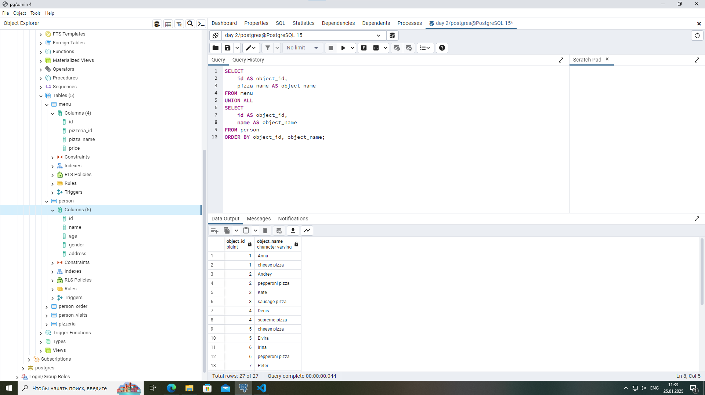

#### Exercise 01 - UNION dance with subquery

Please modify a SQL statement from “exercise 00” by removing the object_id column. Then change ordering by object_name for part of data from the table and then from table (like presented on a sample below). Please save duplicates!personmenu

```sql
SELECT object_name
FROM (
    SELECT 
        name AS object_name, 1 as sort_order
    FROM person
    UNION ALL
    SELECT
        pizza_name AS object_name, 2 as sort_order
    FROM menu
) as nya
ORDER BY sort_order, object_name;
```

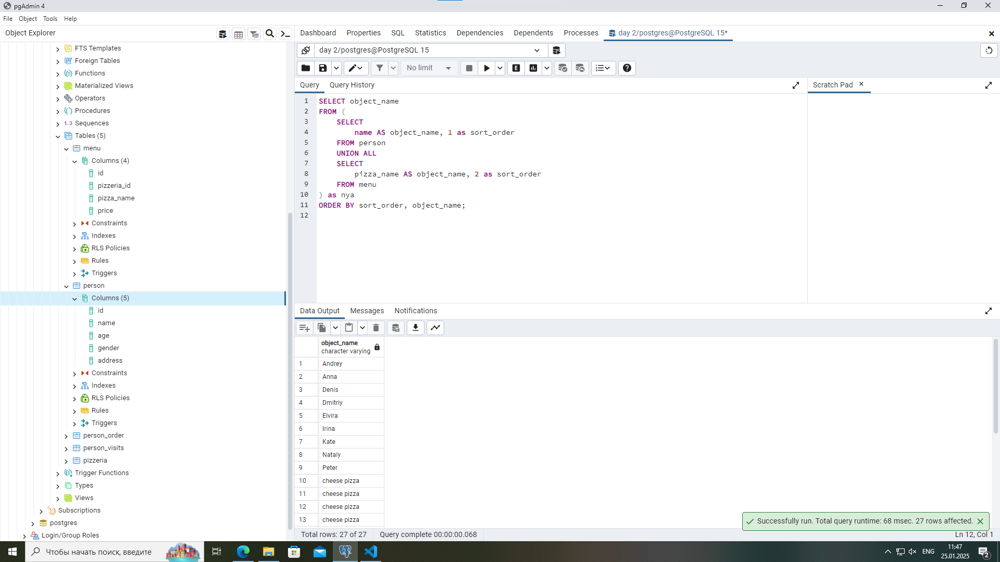

#### Exercise 02 - Duplicates or not duplicates

Please write a SQL statement which returns unique pizza names from the `menu` table and orders them by pizza_name column in descending mode. Please pay attention to the Denied section.

```sql
SELECT pizza_name
FROM menu
EXCEPT
SELECT pizza_name
FROM menu
WHERE pizza_name LIKE '%mushroom%'
ORDER BY pizza_name DESC;
```

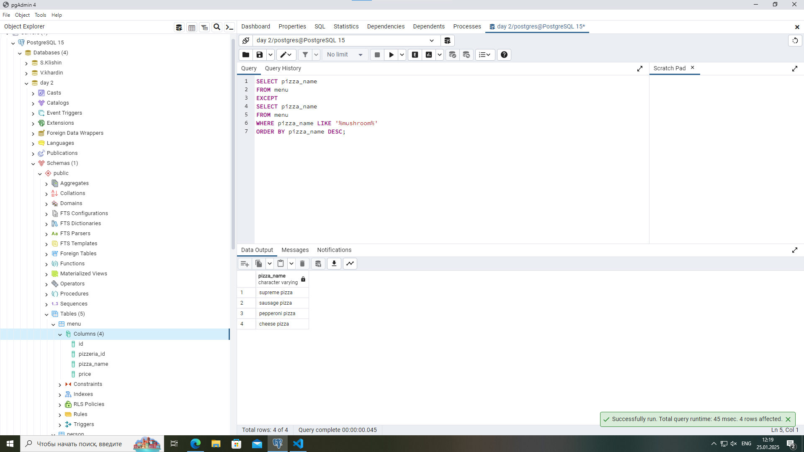

#### Exercise 03 - “Hidden” Insights

Please write a SQL statement which returns common rows for attributes order_date, person_id from table from one side and visit_date, person_id from table from the other side (please see a sample below). In other words, let’s find identifiers of persons, who visited and ordered some pizza on the same day. Actually, please add ordering by action_date in ascending mode and then by person_id in descending mode.person_orderperson_visits

```sql
SELECT order_date AS action_date, person_id
FROM person_order
INTERSECT
SELECT visit_date AS action_date, person_id
FROM person_visits
ORDER BY action_date ASC, person_id DESC;
```

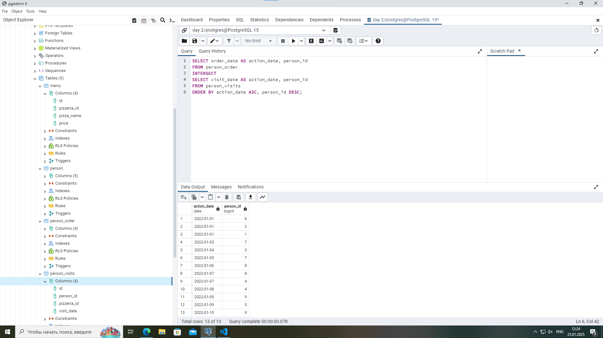

#### Exercise 04 - Difference? Yep, let's find the difference between multisets.

Please write a SQL statement which returns a difference (minus) of person_id column values with saving duplicates between table and table for order_date and visit_date are for 7th of January of 2022person_orderperson_visits

```sql
SELECT person_id
FROM (
    SELECT person_id, 1 AS nya
    FROM person_order
    WHERE order_date = '2022-01-07'
    EXCEPT ALL
    SELECT person_id, -1 AS nya
    FROM person_visits
    WHERE visit_date = '2022-01-07'
) AS Combo
GROUP BY person_id
HAVING SUM(nya) > 0
ORDER BY person_id DESC;
```

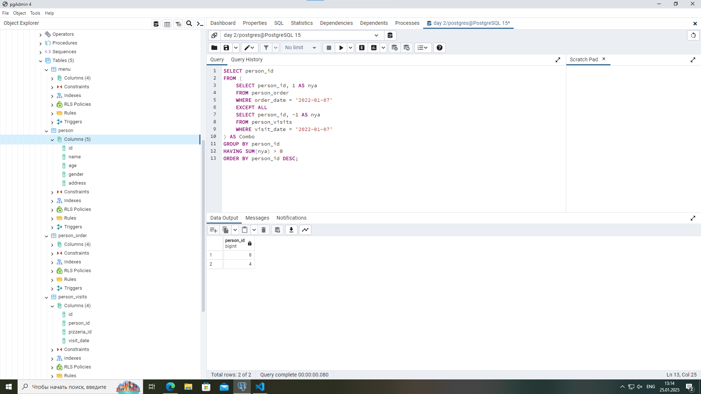

#### Exercise 05 - Did you hear about Cartesian Product?

Please write a SQL statement which returns all possible combinations between and tables and please set ordering by person identifier and then by pizzeria identifier columns. Please take a look at the result sample below. Please be aware column's names can be different for you.personpizzeria

```sql
SELECT
    p.id AS person_id,
    p.name AS person_name,
    p.age AS age,
    p.gender AS gender,
    p.address AS address,
    pz.id AS pizzeria_id,
    pz.name AS pizzeria_name,
    pz.rating AS rating
FROM
    person p
CROSS JOIN
    pizzeria pz
ORDER BY
    p.id ASC,
    pz.id ASC;
```

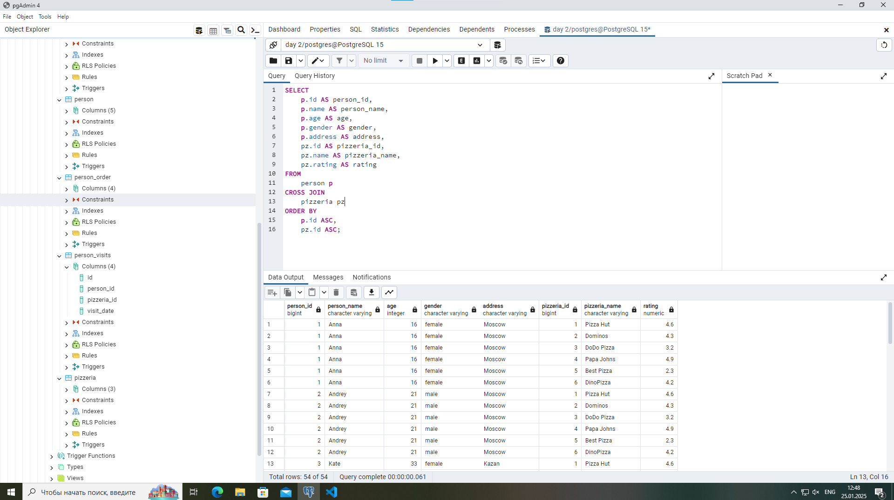

#### Exercise 06 - Lets see on “Hidden” Insights

Let's return our mind back to exercise #03 and change our SQL statement to return person names instead of person identifiers and change ordering by action_date in ascending mode and then by person_name in descending mode. Please take a look at a data sample below.

```sql
SELECT p.name AS person_name, po.order_date AS action_date
FROM person p
INNER JOIN person_order po ON p.id = po.person_id
WHERE (po.order_date,po.person_id) IN (
    SELECT order_date, person_id
    FROM person_order
    INTERSECT
    SELECT visit_date, person_id
    FROM person_visits
)
ORDER BY action_date ASC, person_name DESC;
```

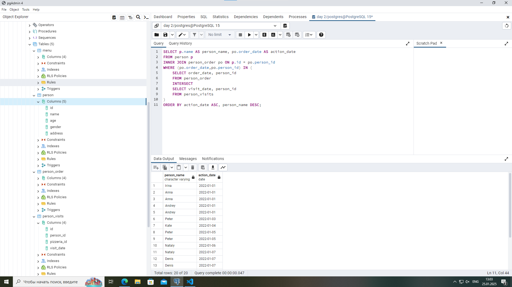

#### Exercise 07 - Just make a JOIN

Please write a SQL statement which returns the date of order from the table and corresponding person name (name and age are formatted as in the data sample below) which made an order from the table. Add a sort by both columns in ascending mode.person_orderperson

```sql
SELECT
    po.order_date,
    p.name || ' (age:' || p.age || ')' AS person_information
FROM
    person_order po
INNER JOIN
    person p ON po.person_id = p.id
ORDER BY
    po.order_date ASC,
    person_information ASC;
```

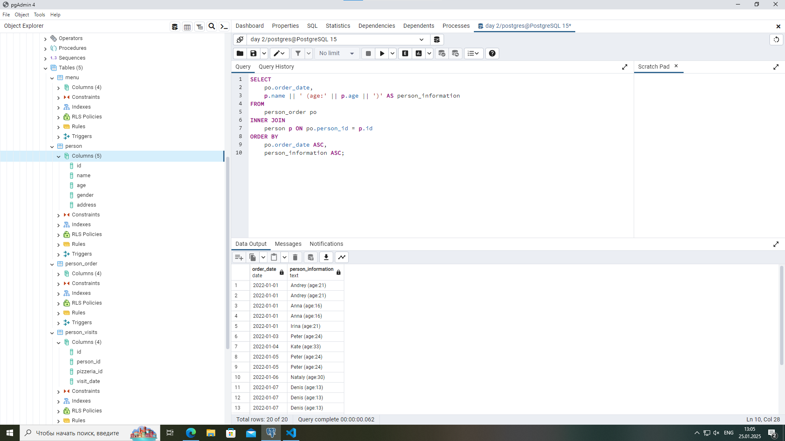

#### Exercise 08 - Migrate JOIN to NATURAL JOIN

Please rewrite a SQL statement from exercise #07 by using NATURAL JOIN construction. The result must be the same like for exercise #07.

```sql
SELECT
    po.order_date,
    p.name || ' (age:' || p.age || ')' AS person_information
FROM
    (SELECT order_date, person_id AS id FROM person_order) po
NATURAL JOIN
    person p
ORDER BY
    po.order_date ASC,
    person_information ASC;
```


#### Exercise 09 - IN versus EXISTS

Please write 2 SQL statements which return a list of pizzerias names which have not been visited by persons by using IN for 1st one and EXISTS for the 2nd one.

IN

```sql
SELECT name
FROM pizzeria
WHERE id NOT IN (SELECT DISTINCT pizzeria_id FROM person_visits);
```

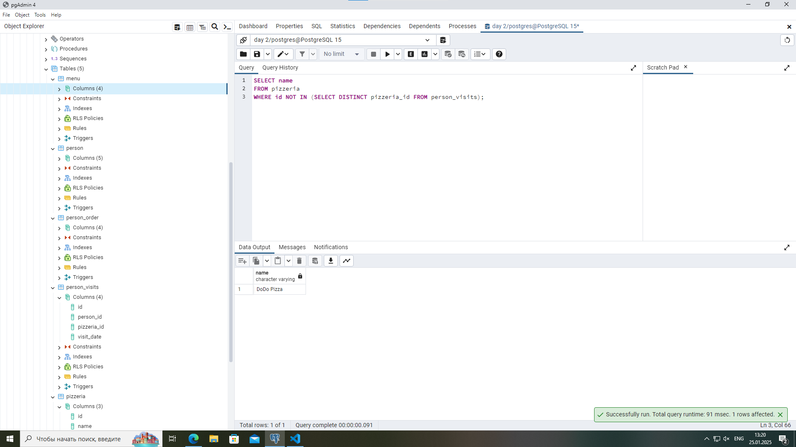

EXCISTS

```sql
SELECT name
FROM pizzeria p
WHERE NOT EXISTS (
    SELECT 1
    FROM person_visits pv
    WHERE pv.pizzeria_id = p.id
);
```

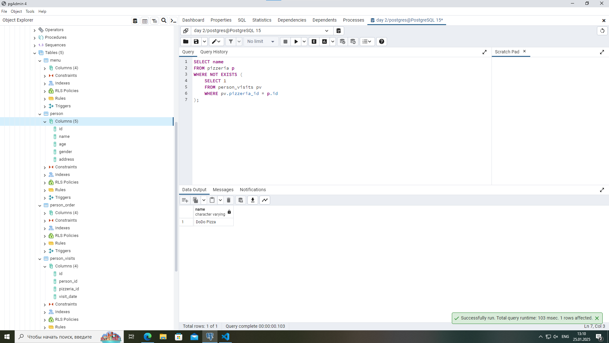

#### Exercise 10 - Global JOIN

Please write a SQL statement which returns a list of the person names which made an order for pizza in the corresponding pizzeria. The sample result (with named columns) is provided below and yes ... please make ordering by 3 columns (, , ) in ascending mode.person_namepizza_namepizzeria_name

```sql
SELECT
    p.name AS person_name,
    m.pizza_name AS pizza_name,
    pz.name AS pizzeria_name
FROM
    person p
INNER JOIN
    person_order po ON p.id = po.person_id
INNER JOIN
    menu m ON po.menu_id = m.id
INNER JOIN
    pizzeria pz ON m.pizzeria_id = pz.id
ORDER BY
    person_name ASC,
    pizza_name ASC,
    pizzeria_name ASC;
```

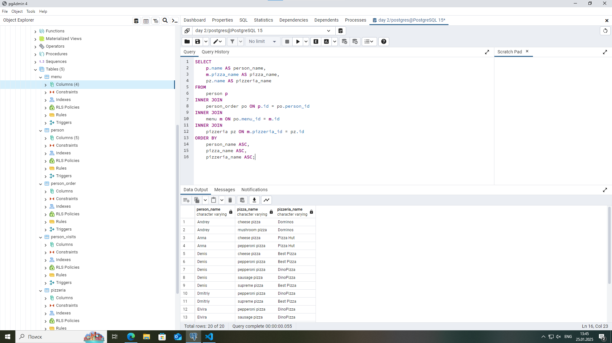